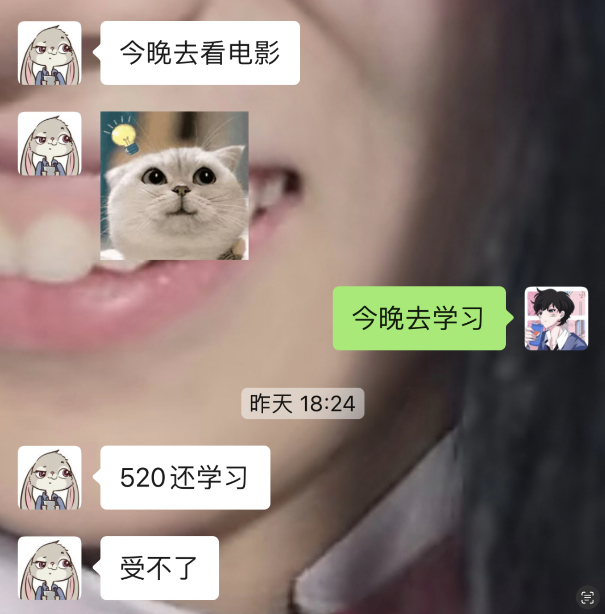

## 2023-05-05

1. 离散数学，命题逻辑的做题方法。**还是要注意去重！**
2. 云计算，找到了`pipeline`的`bug`，发现是因为自己的`socket`一直没关！！ 以后要记得有头有尾，并且要好好记录实验过程，不然一个`bug`要重复写多次。
3. GPU。[GPU](https://github.com/Tswatery/junior_year/blob/main/大三下/操作系统/GPU.md)
4. 前端的CSS。[1.1如何定义CSS？](https://github.com/Tswatery/frontend/blob/main/learninglog/CSS.md#1如何定义css)
5. **人工智能的变量消元法的题，但是还是不是很理解这一点：**

## 2023-05-06

1. 复习并做了两道离散数学题。
2. 中断。[中断](https://github.com/Tswatery/junior_year/blob/main/%E5%A4%A7%E4%B8%89%E4%B8%8B/%E6%93%8D%E4%BD%9C%E7%B3%BB%E7%BB%9F/%E4%B8%AD%E6%96%AD.md)
3. 复习了贝叶斯网络的精确推理。[贝叶斯网络｜精确推理](https://github.com/Tswatery/junior_year/blob/main/%E5%A4%A7%E4%B8%89%E4%B8%8B/%E4%BA%BA%E5%B7%A5%E6%99%BA%E8%83%BD/BN/%E8%B4%9D%E5%8F%B6%E6%96%AF%E7%BD%91%E7%BB%9C%20%EF%BD%9C%20%E6%8E%A8%E7%90%86.md)
4. 昨天问题：[昨天问题的解释](https://github.com/Tswatery/junior_year/blob/main/%E5%A4%A7%E4%B8%89%E4%B8%8B/%E4%BA%BA%E5%B7%A5%E6%99%BA%E8%83%BD/BN/%E8%B4%9D%E5%8F%B6%E6%96%AF%E7%BD%91%E7%BB%9C%20%EF%BD%9C%20%E6%8E%A8%E7%90%86.md#%E5%AF%B9%E4%BA%8E%E6%98%A8%E5%A4%A9%E9%97%AE%E9%A2%98%E7%9A%84%E8%A7%A3%E9%87%8A)

感觉时间还是碎了一点，做的事情不是很多。

## 2023-05-07

1. 分布式系统的两阶段提交，其实是为了看实验如何做。[分布式系统](https://github.com/Tswatery/junior_year/blob/main/大三下/distribute-system/分布式系统.md)
2. 全概率&贝叶斯定理。[概率](https://github.com/Tswatery/junior_year/blob/main/大三下/人工智能/概率/条件概率.md)
3. 单指令周期的CPI。[CPI](https://github.com/Tswatery/junior_year/blob/main/大三下/体系结构/18-447/5微体系结构/5微体系结构介绍.md#cpi)
4. ALU的数据通路，实验做不懂的原因是因为没有看ISA。[ALU数据通路](https://github.com/Tswatery/junior_year/blob/main/大三下/体系结构/18-447/5微体系结构/5.1数据通路.md)

## 2023-05-08

1. 开始了云计算的lab3实验，写了好久，写了很多代码。
2. 人工智能，Gibbs 采样。
3. 看了异构集群中的统一优化架构的论文。[在异构GPUCPU集群中加速分布式DNN训练的统一架构](https://github.com/Tswatery/junior_year/blob/main/大三下/paper/异构集群中加速DNN的统一训练架构/在异构GPUCPU集群中加速分布式DNN训练的统一架构.md)
4. 并行计算，有关openmp的。[openmp](https://github.com/Tswatery/junior_year/blob/main/大三下/并行计算/openmp.md)

## 2023-05-09

1. 人工智能的采样。[sampling](https://github.com/Tswatery/junior_year/blob/main/大三下/人工智能/BN/贝叶斯网络｜推理.md#近似推理-sampling)

## 2023-05-10

1. 缓存。[cache](https://github.com/Tswatery/junior_year/blob/main/大三下/计算机系统/缓存.md)
2. 缓存在多线程程序性能中应用分析。[cache in openmp](https://github.com/Tswatery/junior_year/blob/main/大三下/并行计算/openmp.md#5缓存缓存一致性伪共享)

## 2023-05-11

1. `LoadStore`指令的数据通路。[Load&Store](https://github.com/Tswatery/junior_year/blob/main/大三下/体系结构/18-447/5微体系结构/5.1数据通路.md#loadstore的数据通路)
1. 虚拟内存开始复习。[virtual memory](https://github.com/Tswatery/junior_year/blob/main/大三下/计算机系统/9虚拟内存.md)
1. 缓存的类型。[cache](https://github.com/Tswatery/junior_year/blob/main/大三下/计算机系统/6缓存.md)

感觉每天都在摸鱼。。明天把页式存储看点，然后`cache`的题做一做。

## 2023-05-12

1. 离散数学谓词逻辑的复习，存在指定必须在全称指定前面。[谓词逻辑的复习](https://github.com/Tswatery/junior_year/blob/main/大三下/离散数学/第二章谓词逻辑/谓词逻辑的复习.md)
2. 离散数学前束范式。[前束范式](https://github.com/Tswatery/junior_year/blob/main/大三下/离散数学/第二章谓词逻辑/前束范式.md)

## 2023-05-13

1. 离散数学的第四章。拉格朗日定理、等价类与陪集。[第四章](https://github.com/Tswatery/junior_year/blob/main/大三下/离散数学/第四章代数系统/第四章复习.md)
2. 离散数学的第三章。哈斯图。[第三章](https://github.com/Tswatery/junior_year/blob/main/大三下/离散数学/第三章/第三章复习.md)

这两天把离散数学的作业做完了。

## 2023-05-14

1. 把简历写了一下然后海了吉大的计院和软院，希望能成功入营。
2. 学习了体系结构中的控制流的数据通路。[控制流的数据通路](https://github.com/Tswatery/junior_year/blob/main/大三下/体系结构/18-447/5微体系结构/5.1数据通路.md#控制流的数据通路) 其实其中还记录了硬布线和微程序的区别。

[第一周周报](./周报/第一周（大三下第13周周报）.md)

---

## 2023-05-15

1. 学习怎么做面不糊应该也算一种学习吧？今天的面太糊了！幸好买了韭菜炒蛋垫底。
2. 使用mpi、openmp写了计算$\pi$的多线程程序，目的在于练习这两种模型。[MPI](https://github.com/Tswatery/junior_year/blob/main/大三下/并行计算/MPI.md) [openmp](https://github.com/Tswatery/junior_year/blob/main/大三下/并行计算/openmp.md) [代码](https://github.com/Tswatery/junior_year/tree/main/大三下/并行计算/代码)

## 2023-05-16

1. 机器学习。什么是机器学习？什么是朴素贝叶斯算法？
1. 哦原来煮面需要在温水的时候（怎么判断温水？水开始冒泡或冒烟的时候）放入面条， 因为面条总归还是淀粉做的，在沸水中容易融化，淀粉融化就变糊了。。。

## 2023-05-17

摸鱼的一天，写了点云计算代码，被果哥问什么时候考核论文，哥们还没看呢😭。

## 2023-05-18

1. 决策树算法，做了两道题。
2. 感知机入门，就是一个两层的神经网络。
3. L1缓存分离设计的原因。

## 2023-05-19

1. 离散数学的图论，欧拉图、哈密顿图、Powell染色法、对偶图的画法、邻接矩阵的幂次、Prim和Kruskal算法。
1. 复习了陪集，陪集就是拿一个元素去跟某个子群内的所有元素进行运算。
1. paper的阅读、PS架构、all reduce算法。

## 2023-05-20

1. 把头歌实验3的实验报告写完了，复习了贝叶斯公式以及全概率公式；
2. 看了《机器学习｜周志华》的朴素贝叶斯分类器的过程，**其实朴素贝叶斯就是将样本的属性视为独立的，并计算它们的乘积**。[Naive Bayes](https://github.com/Tswatery/junior_year/blob/main/大三下/人工智能/ML/人工智能｜机器学习.md#具体过程---20200520)

救命，怎么有人520也在学习！

## 2023-05-21

1. 计分牌、Tomasulo算法。在知乎上找到了一个博主专门讲体系结构方面的，觉得很不错。[Tomasulo](https://zhuanlan.zhihu.com/p/499978902)｜[ScoreBoard](https://zhuanlan.zhihu.com/p/496078836) 其实学一个东西，多看几遍自然就会了。
2. 复习论文的all reduce、PS的通信架构。😭一想到果哥的云计算和paper就很焦躁。
3. 尝试复现raft算法，完成了选举过程。

## 2023-05-22

1. 使用MPI写了一个简易的矩阵乘法，很简单，采用的是将矩阵`a`分行然后分别和矩阵`b`相乘，再收集回来。其实是基于GPT的版本，我觉得主要弄明白矩阵相乘中`c[i * cols + j] += a[i * common_dim + k] * b[k * cols + j];`的原因即可。[MPI](https://github.com/Tswatery/junior_year/blob/main/大三下/并行计算/MPI.md) [代码](https://github.com/Tswatery/junior_year/blob/main/大三下/并行计算/代码/mpi_matrix.cpp)
2. 大致实现了`raft`版本，但是跑不起来，用了一下午+一晚上。

## 2023-05-23

1. 实现了简易的`raft`版本。

## 2023-05-23

1. 给学校服务器节点配置了12个用户，使用的是`python`的`subprocess`和`pexpect`，后者可以和命令行进行交互。请注意`chmod 700`这个命令，它是更改文件或目录的权限，指定某个用户具有读取、写入的权限，但是同组的其他用户没有任何权限。

## 2023-05-29

一周没更新了，最近一周在复习HNU期末考试，上周把raft复现了。

1. 人工智能HMM。HMM包括隐藏状态链、可观察状态，其中隐藏状态链之间是有转移概率矩阵的，然后隐藏状态和对应的观察状态还有一个输出概率。举个例子，隐藏状态链就是某人连续几天心情的变化，可观察状态就是某天心情为开心时，观察他去了酒吧。转移概率就是今天开心，明天也开心的概率；输出概率是一个条件概率，如果今天开心，那么他去酒吧的概率。
2. 人工智能决策树、朴素贝叶斯。决策树太难算了。。 朴素贝叶斯就是将概率拆分，不过要乘以原来的概率。
3. 云计算ppt优化

## 2023-05-30

1. 复习了流水线，做了期中考试的两个题。在转发的时候要注意数据依赖的问题；
2. 复习了ISA，期中的那个RISC-V的题，其实在设计中`imm[a:b]`表示的就是立即数的`a`到`b`位。
3. 复习了HMM，其实HMM中的概率是有叠加性的，比如第二天的概率有可能是在第一天的基础上是xx，然后第二天是xx。

