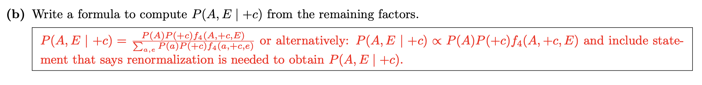

## 2023-05-05

1. 离散数学，命题逻辑的做题方法。**还是要注意去重！**
2. 云计算，找到了`pipeline`的`bug`，发现是因为自己的`socket`一直没关！！ 以后要记得有头有尾，并且要好好记录实验过程，不然一个`bug`要重复写多次。
3. GPU。[GPU](https://github.com/Tswatery/junior_year/blob/main/大三下/操作系统/GPU.md)
4. 前端的CSS。[1.1如何定义CSS？](https://github.com/Tswatery/frontend/blob/main/learninglog/CSS.md#1如何定义css)
5. **人工智能的变量消元法的题，但是还是不是很理解这一点：**

## 2023-05-06

1. 复习并做了两道离散数学题。
2. 中断。[中断](https://github.com/Tswatery/junior_year/blob/main/%E5%A4%A7%E4%B8%89%E4%B8%8B/%E6%93%8D%E4%BD%9C%E7%B3%BB%E7%BB%9F/%E4%B8%AD%E6%96%AD.md)
3. 复习了贝叶斯网络的精确推理。[贝叶斯网络｜精确推理](https://github.com/Tswatery/junior_year/blob/main/%E5%A4%A7%E4%B8%89%E4%B8%8B/%E4%BA%BA%E5%B7%A5%E6%99%BA%E8%83%BD/BN/%E8%B4%9D%E5%8F%B6%E6%96%AF%E7%BD%91%E7%BB%9C%20%EF%BD%9C%20%E6%8E%A8%E7%90%86.md)
4. 昨天问题：[昨天问题的解释](https://github.com/Tswatery/junior_year/blob/main/%E5%A4%A7%E4%B8%89%E4%B8%8B/%E4%BA%BA%E5%B7%A5%E6%99%BA%E8%83%BD/BN/%E8%B4%9D%E5%8F%B6%E6%96%AF%E7%BD%91%E7%BB%9C%20%EF%BD%9C%20%E6%8E%A8%E7%90%86.md#%E5%AF%B9%E4%BA%8E%E6%98%A8%E5%A4%A9%E9%97%AE%E9%A2%98%E7%9A%84%E8%A7%A3%E9%87%8A)

感觉时间还是碎了一点，做的事情不是很多。

## 2023-05-07

1. 分布式系统的两阶段提交，其实是为了看实验如何做。[分布式系统](https://github.com/Tswatery/junior_year/blob/main/大三下/distribute-system/分布式系统.md)
2. 全概率&贝叶斯定理。[概率](https://github.com/Tswatery/junior_year/blob/main/大三下/人工智能/概率/条件概率.md)
3. 单指令周期的CPI。[CPI](https://github.com/Tswatery/junior_year/blob/main/大三下/体系结构/18-447/5微体系结构/5微体系结构介绍.md#cpi)
4. ALU的数据通路，实验做不懂的原因是因为没有看ISA。[ALU数据通路](https://github.com/Tswatery/junior_year/blob/main/大三下/体系结构/18-447/5微体系结构/5.1数据通路.md)

## 2023-05-08

1. 开始了云计算的lab3实验，写了好久，写了很多代码。
2. 人工智能，Gibbs 采样。
3. 看了异构集群中的统一优化架构的论文。[在异构GPUCPU集群中加速分布式DNN训练的统一架构](https://github.com/Tswatery/junior_year/blob/main/大三下/paper/异构集群中加速DNN的统一训练架构/在异构GPUCPU集群中加速分布式DNN训练的统一架构.md)
4. 并行计算，有关openmp的。[openmp](https://github.com/Tswatery/junior_year/blob/main/大三下/并行计算/openmp.md)

## 2023-05-09

1. 人工智能的采样。[采样](https://github.com/Tswatery/junior_year/blob/main/大三下/人工智能/BN/贝叶斯网络 ｜ 推理.md#近似推理-sampling)

## 2023-05-10

1. 缓存。[cache](https://github.com/Tswatery/junior_year/blob/main/大三下/计算机系统/缓存.md)
2. 缓存在多线程程序性能中应用分析。[cache in openmp](https://github.com/Tswatery/junior_year/blob/main/大三下/并行计算/openmp.md#5缓存缓存一致性伪共享)
